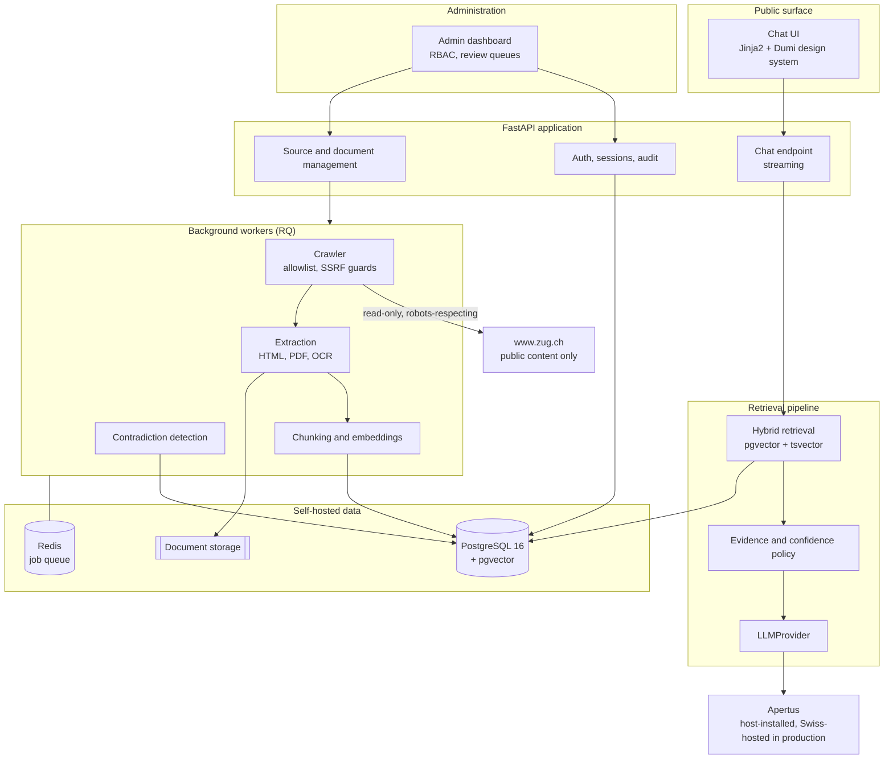
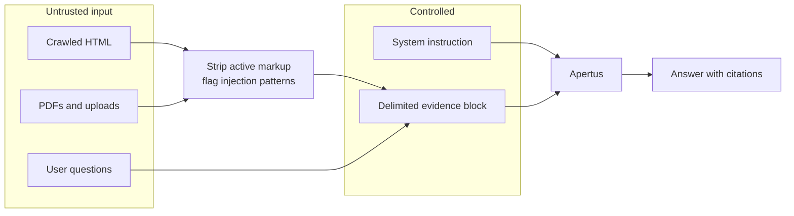

# Architecture assessment and implementation plan

Phase 1 deliverable. Written after inspecting every file in the repository at
commit `c23adea`.

## 1. Correction to the brief

The brief states that an existing user interface is present and must be
preserved and connected to a real backend. That is not what is in the
repository, and building on the assumption would produce a false claim later.

What actually exists is four commits of brand work and nothing else:

```
CLAUDE.md                  project rules
README.md                  product summary
shared/brand/              design tokens, the animated Dumi mark, favicon set
shared/brand/preview.html  a brand specimen sheet
```

There is no frontend framework, no backend, no database, no dependency
manifest, no container configuration, no authentication, and no tests. The
`preview.html` chat mock is a static specimen that demonstrates the intended
visual language. It is not a working interface.

So "preserve the existing UI" is read here as: **preserve the Dumi design
system**. Specifically the tokens in `dumi-tokens.css`, the mark and its
state machine in `dumi-mark.css`, the favicon set, and the visual language the
specimen sheet establishes for the chat surface. The application is built
around that layer rather than replacing it. Nothing in `shared/brand/` is
rewritten except where a requirement in the brief demands it, and each such
change is recorded in section 4.

## 2. Verified environment

Checked directly rather than assumed.

| Component | Result |
|---|---|
| Python | 3.11.15 |
| Node | 22.22.2 |
| PostgreSQL client | 16.13 |
| Docker | 29.3.1 |
| Apertus on `localhost:11434` | unreachable |
| Apertus on `localhost:8000` | unreachable |

Apertus is installed on the developer's desktop. This build session runs in a
remote container, so no Apertus endpoint is reachable from here. The provider
layer is therefore written against a configurable base URL and is verified
with a recorded fake plus a contract test, and the developer confirms the live
endpoint locally. This limitation is stated rather than worked around, and it
is repeated in the known-limitations document.

## 3. Design system inventory

The classes that exist today and that the application must build on:

| Class | Role in the application |
|---|---|
| `.dumi` plus `__orb`, `__blob`, `__core`, `__sheen` | The mark. Launcher, message avatar and status indicator. |
| `data-state="idle \| listening \| thinking"` | The only status indicator in the product. No spinner, no typing dots. |
| `.dumi-lockup`, `.dumi-lockup__tag` | Name plus a qualifier such as "Prototype". |
| `.dumi-bar`, `.dumi-bar__canton` | Header. The canton slot stays unused until Zug formally adopts the assistant. |
| `.dumi-launcher` | Fixed bottom-right entry point. |
| `--dumi-*` tokens | Palette, type, motion, and the single per-canton accent. |

The specimen sheet also establishes, without implementing, the message bubble,
the citation marker, and the suggestion chip. Those become real components in
Phase 4.

## 4. Blockers and security concerns found

Two were fixed immediately because they blocked any further commit.

**No `.gitignore` (fixed in `6cd8768`).** The repository had none. The first
`.env` created during setup holds the local database and administrator
credentials, so the ignore rules had to land before any configuration work.

**Implied Canton of Zug affiliation (fixed in `c23adea`).** The chat mock
rendered a blue-white-blue coat of arms beside the Dumi lockup. That is the
Zug arms, and it claims endorsement the project does not have, which section
22 of the brief prohibits. Replaced with the required prototype disclosure and
a language selector.

Open concerns carried into later phases:

- **No dependency manifest exists yet**, so there is no lockfile and no
  vulnerability scanning. Addressed at the start of Phase 2.
- **The brand layer has no build step**, which is a feature worth keeping. It
  constrains the frontend choice, see decision D2.
- **`shared/brand/favicon/build.sh` shells out to Chromium.** It is a
  developer tool and never runs in production, but it must stay out of any
  production image.
- **The specimen sheet is published as a hosted artifact.** It contains no
  secrets and no personal data. It must not become the production entry point.

## 5. Technical decisions

Each decision records the alternative rejected, so a later reviewer can
re-open it with the reasoning intact.

**D1. Backend: Python 3.11 with FastAPI.**
The workload is ingestion-heavy. Crawling, HTML extraction, PDF parsing, OCR,
embeddings and pgvector all have mature, self-hostable Python libraries.
FastAPI gives async request handling for streamed chat responses and typed
request validation, which section 13 requires. Rejected: Node with TypeScript,
which would be a reasonable API layer but forces a second runtime for the
extraction and embedding pipeline.

**D2. Frontend: server-rendered Jinja2 templates with progressive enhancement.**
The existing design layer is plain CSS custom properties with no build step. A
single-page framework would force it through a bundler and a component
rewrite, which is precisely the replacement the brief prohibits. Server
rendering also makes the WCAG 2.2 AA target in section 15 substantially
easier, because the page works without JavaScript and the streamed answer can
be announced through a live region rather than reconstructed in a virtual DOM.
Rejected: React or Svelte.

**D3. Database: PostgreSQL 16 with pgvector, migrated by Alembic.**
Self-hosted, required by section 5. pgvector keeps semantic search and
relational metadata in one system with one backup and one consistency story,
which matters because retrieval has to filter on source status and freshness.
Rejected: a separate vector service, which section 10 prohibits when hosted
externally and which would add a second consistency problem when self-hosted.

**D4. Full-text search: PostgreSQL `tsvector` with per-language
configurations.** Hybrid retrieval in section 10 needs a keyword arm. Postgres
ships German, English, French and Italian stemmers, which covers the four
required languages without another dependency.

**D5. Background jobs: Redis with RQ.**
Crawling, extraction, OCR, embedding and synchronization are long-running and
must survive a web restart. RQ is chosen over Celery for readability, which
the brief asks for explicitly. Rejected: Celery, more capable and harder to
follow; in-process background tasks, which lose work on restart.

**D6. Password hashing: Argon2id via `argon2-cffi`.**
Named in section 5.

**D7. LLM access: an `LLMProvider` protocol with an OpenAI-compatible Apertus
provider.** Apertus is typically served through vLLM or Ollama, both of which
expose an OpenAI-compatible chat completions API. Targeting that interface
behind a protocol means the serving framework can change without touching
call sites, which section 4 requires since the framework must not be assumed.

**D8. Embeddings: a self-hosted multilingual sentence-transformers model,
configurable by environment variable.** Must handle de, en, fr and it, and
must not call an external service. The specific model is configuration, not
code, so it can be upgraded through the index-rebuild path in section 17.

**D9. Local database interface: Adminer bound to `127.0.0.1`.**
Section 5 requires localhost-only binding. Adminer is a single container with
no persistent state of its own.

## 6. Target architecture



The one-way arrow from the crawler to `zug.ch` is deliberate. The crawler
issues read-only requests, never submits forms, and never performs
state-changing requests.

## 7. Trust boundary

Everything crossing into the system from outside is untrusted, including
content published by the canton itself.



A crawled page that contains text resembling an instruction is data. It never
becomes an instruction. This is enforced by keeping the system instruction in
a separate message, delimiting evidence explicitly, exposing no tools to the
model, and testing indirect injection through pages, PDFs, filenames and
metadata as section 23 requires.

## 8. Implementation plan

Phase numbering follows the brief. Each item is a commit or a small group of
commits.

**Phase 2, secure foundation.** Dependency manifest and lockfile. Settings
module with validation. `.env.example`. Docker Compose with Postgres,
pgvector, Redis, Adminer on localhost, worker and app. Alembic. Schema for
users, roles, sessions and audit events. Argon2id hashing. Administrator
bootstrap command with forced password change. Production startup checks that
refuse the development passwords. Audit logging. Health endpoints. The
`LLMProvider` protocol and the Apertus provider.

**Phase 3, ingestion.** Zug hostname allowlist. SSRF-safe HTTP client with
address validation and redirect revalidation. robots.txt and crawl-delay
handling. Sitemap discovery. Crawl scheduling with per-host limits. Content
hashing and conditional requests. HTML extraction and boilerplate removal. PDF
extraction with page anchors. Optional OCR. Document versioning. Source
management endpoints.

**Phase 4, retrieval and chat.** Semantic chunking with citation metadata.
Embedding generation. Hybrid retrieval with reranking. Evidence assembly and
the confidence policy. Prompt construction with delimited evidence. Streaming
chat endpoint. The chat UI built on the existing design system. Language
detection and selection. Citation rendering. Insufficient-evidence behaviour.
High-risk topic handling.

**Phase 5, administration and quality.** Upload workflow with magic-byte
validation and quarantine. Contradiction detection and the review queue. Index
versioning and atomic promotion. Feedback review. Evaluation suite. Monitoring
dashboard.

**Phase 6, production readiness.** Security tests. Accessibility verification.
Privacy documentation and the draft impact assessment. Deployment guides.
Backup and restore testing. Proposed SLA. Training material. Maintenance
plans.

## 9. Requires qualified human review

Marked here so it is not lost, and so no document in this repository claims
these have been completed.

- The draft data protection impact assessment needs review by a qualified
  Swiss privacy professional. Nothing produced here is legal advice.
- The crawler policy and its reading of the `zug.ch` terms of use need review
  by someone with authority to accept the legal risk of crawling.
- Any claim of Swiss data residency must be verified against the actual
  deployment. Until then the documentation says the prototype is not
  Swiss-hosted.
- The accessibility report needs manual screen-reader and keyboard testing by
  a person. Automated checks cover a minority of WCAG 2.2 criteria.
- The proposed SLA is a draft for negotiation. No service level exists.
- Use of the Canton of Zug name, arms or content in any published deployment
  needs permission from the canton.
