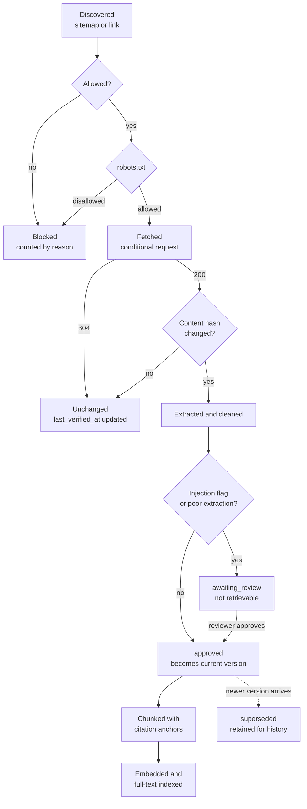

# Content lifecycle

From a URL to a citation, and what happens when the canton edits the page.

## States

| State | Meaning | Retrievable |
|---|---|---|
| `pending` | Fetched, not yet processed | No |
| `awaiting_review` | Indexed, needs a person | No |
| `approved` | Usable in answers | Yes, if it is the current version |
| `superseded` | A newer version replaced it | No, retained for citation history |
| `excluded` | A reviewer ruled it out | No, reason retained |
| `gone` | Removed from the canton site | No, retained so old citations stay explicable |
| `failed` | Extraction or a safety check failed | No |
| `quarantined` | Held pending a malware or content check | No |

## Why versions are kept

A citation issued last month has to remain explicable after the canton edits
the page. Overwriting would leave an answer pointing at text that no longer
exists with no way to show what it said.

Superseding marks the old version; it never deletes it.

## What happens when content disappears

A URL returning 404 or 410 repeatedly should move to `gone`, keeping its
history. **Not implemented:** nothing currently transitions a document to
`gone`. A removed page keeps its last approved version and stays retrievable,
which is a real gap and is listed in the known limitations.

## Automatic approval, and when it does not apply

Crawled canton pages are approved on ingest, because requiring a human to
approve every page of a large public site would mean nothing ever got indexed.

Approval is withheld automatically when the content carries an injection flag
or when extraction quality is low or failed. Those go to `awaiting_review` and
cannot be retrieved until a person looks.

Administrator uploads are never auto-approved.
