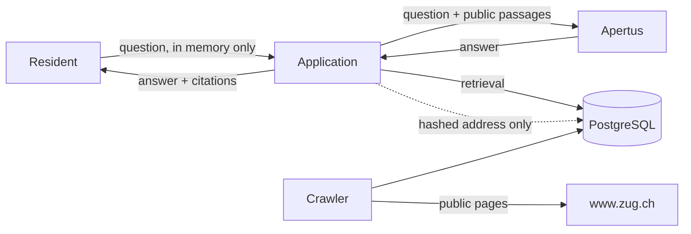

# Privacy and data flows

Prepared for the Swiss Federal Act on Data Protection (revFADP) and applicable
cantonal requirements.

**This document has not been reviewed by a qualified Swiss privacy
professional. Nothing in it is legal advice, and it does not establish
compliance.** Section 14 of the brief requires that statement and it is meant
literally.

## The design decision that matters most

The public assistant requires no account, sets no cookie it does not need, and
does not store conversations. That is not a feature to be switched on later;
it is the reason most of this document is short.

Turning on transcript storage needs a documented legal basis, a retention
period, a deletion procedure and a person accountable for it. The
configuration flag exists; using it is a data protection decision, not a
technical one.

## What is stored

| Category | Where | Purpose | Retention | Who can read it |
|---|---|---|---|---|
| Administrator email, name | `users` | Identify staff | Life of the account | Super administrator |
| Password hash (Argon2id) | `users` | Authentication | Life of the account | Nobody, by design |
| Session records | `user_sessions` | Authentication, revocation | Until expiry, then purged | Super administrator |
| Hashed client address | `user_sessions`, `audit_events` | Abuse control, investigation | With the parent row | Super administrator, auditor |
| Audit events | `audit_events` | Accountability | Policy, default indefinite | Super administrator, auditor |
| Crawled public content | `documents`, `document_versions`, `chunks` | Answering | Version history retained | Staff |
| Chat transcripts | not stored by default | — | — | — |

## What is deliberately not stored

- Question text. It is never written to the database or to a log.
- Raw IP addresses. There is no configuration under which one is stored.
- Answers, beyond the response itself.
- Any identifier linking one question to another.

## Client address handling

Addresses are HMACed under `SECRET_KEY`, which lives in the environment rather
than the database. A plain hash would be pointless: there are about four
billion IPv4 addresses, so an unsalted digest is reversible by enumeration in
minutes. With the key held separately, a database disclosure alone does not
reveal who visited.

Rotating `SECRET_KEY` makes old hashes unlinkable to new ones. That is a
privacy improvement and it resets abuse history.

## Data flow

The question does reach Apertus. Where Apertus runs is therefore a data
protection question, not only an engineering one: on a developer's desktop it
does not leave the machine, and in production it must be on infrastructure
whose location is known and documented. Nothing here sends conversation or
source data to a non-Swiss third-party AI service, and the architecture has no
place to configure one.

## Processors and transfers

| Processor | Data | Location |
|---|---|---|
| Apertus (self-hosted) | Question text, retrieved public passages | Wherever deployed. Not verified as Swiss in this prototype. |
| PostgreSQL (self-hosted) | Everything above | Wherever deployed |
| Embedding model (local) | Passage and question text | In-process |

No external AI service, no managed database, no analytics provider. Adding one
would be a change to this table first.

## Rights

Because no account is required and no transcript is kept, there is normally no
personal data to access, correct or delete for a public user. If transcript
storage is enabled that changes entirely, and an access and deletion procedure
becomes mandatory rather than optional.

For staff accounts: access through the administration interface, correction by
a super administrator, deletion by deactivation. Accounts are deactivated
rather than deleted, so audit events keep referring to a row that exists.

## Retention

Configurable through `CHAT_RETENTION_DAYS`, default 0. Sessions are purged
after absolute expiry. Audit retention has no automatic policy: the value of
an audit log is partly that it is long, and pruning it is a decision for
whoever is accountable for it.

## Required before public use

- Review by a qualified Swiss privacy professional.
- A published privacy notice at a real URL. `docs/privacy-notice.md` is a
  placeholder.
- A completed data protection impact assessment. `docs/dpia-draft.md` is a
  template with open questions, not an assessment.
- A decision on audit retention, with a person named.
- Verification of where Apertus and the database actually run.
